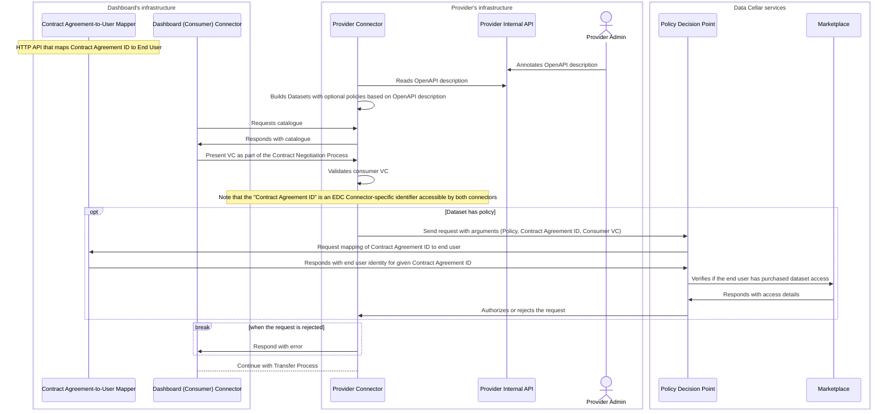

# Data Cellar Sequence Diagrams

## Provisioning and Synchronising Local Catalogues with the Federated Catalogue

This sequence diagram is closely linked to **SUC 2 (Discovery)** as it shows how the Gaia-X Federated Catalogue, which is essential for discovery, is provisioned and kept up-to-date by the participants of Data Cellar.

In Data Cellar, the CDE is a software service that functions as a gateway between the data sources provided by the administrators of the Validation Cases and the data space. It exposes an HTTP API, described by an OpenAPI document, which is then picked up by the connector to build its internal DCAT-based catalogue. The CDE also generates the Gaia-X service offerings via the *Web UI*.

The Web UI (also referred to as the *Credentials Manager* in other Data Cellar resources) is a local web application designed to simplify operations for the administrator of the Validation Case. It is a bespoke application developed specifically for Data Cellar.

It is important to note, however, that at no point in the process is the catalogue translated from DCAT to Gaia-X. Instead, the CDE serves as the origin for both catalogues—the DCAT-based connector's local catalogue and the Gaia-X Federated Catalogue—which coexist in the data space.

```mermaid
sequenceDiagram
    box Participant's Infrastructure
    actor USR as Validation Case
    participant CON as Connector
    participant WUI as Web UI
    participant CDE as CDE
    end
    box Data Cellar Services
    participant XFC as Federated Catalogue
    end
    participant CCC as Consumer Connector
    actor CNS as Consumer
    CON->>CDE: Gets OpenAPI description
    CDE-->>CON: OpenAPI description file
    CON->>CON: Builds connector DCAT-based catalogue
    USR->>WUI: Reviews and requests catalogue synchronisation
    WUI->>CDE: Gets list of Gaia-X Service Offerings
    CDE-->>WUI: List of Service Offerings
    WUI->>WUI: Builds and signs Verifiable Presentations of Service Offerings
    WUI->>XFC: Synchronises Service Offerings
    CNS->>XFC: Browses catalogue and selects a Service Offering
    CNS->>CNS: Retrieves the ID of the DCAT-based connector's catalogue from the Service Offering
    CNS->>CCC: Initiates the process to consume that DCAT Dataset
 ```

## Contracting an Offer via the Dashboard

This sequence diagram relates to **SUC 3 (Contracting)** as it illustrates the process an end user follows to obtain access to a dataset provided by another counterparty connector, following the contract negotiation process as specified by the Dataspace Protocol.

In Data Cellar, end users may be part of a Validation Case, such as a Local Energy Community, which serves as one of the main data sources for the Data Cellar data space. Whether or not they belong to a Validation Case, users can interact with the data space via the Dashboard—a user-friendly web interface designed to simplify the technical complexities of deploying, configuring, and interacting with the APIs of an Eclipse Dataspace Components Connector.

A key feature of the Dashboard is that its DID is implicitly trusted by all participants in the data space. The Dashboard functions as a superuser. However, participants have the option to opt out of this implicit trust if they wish, although this may result in some features no longer working properly.

```mermaid
sequenceDiagram
    actor USR as End User
    box Dashboard's infrastructure
    participant DAS as Dashboard
    participant DBC as Connector
    end
    Note over DBC: Single instance shared by all end users
    box Data Cellar services
    participant IAM as Keycloak
    participant MKP as Marketplace
    end
    box Counterparty (Provider)
    participant PVC as Connector
    participant PAP as Provider API
    end
    USR->>DAS: Logs in
    DAS<<->>IAM: Integrates with central IAM for identity management
    DAS<<->>MKP: Integrates with Marketplace to list offerings
    USR->>DAS: Selects an offering
    DAS->>DBC: Initiates contract negotiation
    DBC<<->>PVC: Conducts contract negotiation as specified by the Dataspace Protocol
    PVC-->>DAS: Responds with an access token once contract negotiation is complete
    DAS->>PVC: Uses the access token to call the Provider API
    PVC-->>PAP: Proxies the HTTP request
```

## Integrating the Policy Decision Point into Data Cellar

This sequence diagram illustrates the role of the Policy Decision Point (PDP) in Data Cellar, specifically how the connector depends on the PDP, which in turn relies on the Marketplace, to approve or reject contract negotiation requests.

The PDP plays a key role in Data Cellar: it is the component that encapsulates the business logic to enforce policies and translate between organisation-level identity and end-user identity. The connectors in Data Cellar are fairly restricted when it comes to access to the context of the contract negotiation (e.g., who is the end user involved in the contract negotiation, are there any marketplace transactions related to the contract negotiation)—the PDP addresses this restriction.

It is important to note that, due to the separation between the end-user-level identity of the dashboard and the organisation-level identity of the connector, the dashboard must provide an HTTP API to map *Contract Agreement IDs* to *end-user identities*. By *end-user identities*, we refer to the details of the user as stored in Data Cellar's central Keycloak server.



