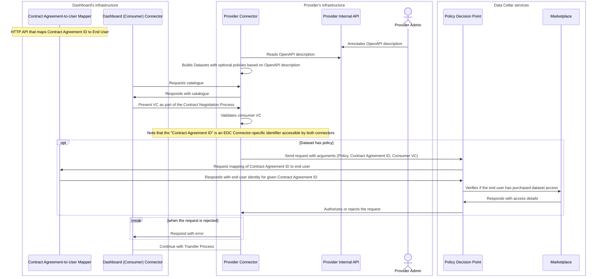

# Data Cellar Sequence Diagrams

## Integrating the Policy Decision Point into Data Cellar

This sequence diagram illustrates the role of the Policy Decision Point (PDP) in Data Cellar, specifically how the connector depends on the PDP, which in turn relies on the Marketplace, to approve or reject contract negotiation requests.

The PDP plays a key role in Data Cellar: it is the component that encapsulates the business logic to enforce policies and translate between organisation-level identity and end-user identity. The connectors in Data Cellar are fairly restricted when it comes to access to the context of the contract negotiation (e.g., who is the end user involved in the contract negotiation, are there any marketplace transactions related to the contract negotiation)—the PDP addresses this restriction.

It is important to note that, due to the separation between the end-user-level identity of the dashboard and the organisation-level identity of the connector, the dashboard must provide an HTTP API to map *Contract Agreement IDs* to *end-user identities*. By *end-user identities*, we refer to the details of the user as stored in Data Cellar's central Keycloak server.



## Provisioning and Synchronising Local Catalogues with the Federated Catalogue

The following sequence diagram illustrates how the stack of software services present on each participant interacts to provision the local catalogue of the connector. This catalogue is based on the DCAT ontology as defined by the Dataspace Protocol and is then transformed into the Gaia-X Trust Framework model, enabling it to be fed into the Gaia-X Federated Catalogue, a central component of Data Cellar. In this way, the Federated Catalogue provides an aggregated view of the offerings from the participants in the data space.

This sequence diagram is closely linked to **SUC 2 (Discovery)** as it shows how the Gaia-X Federated Catalogue, which is essential for discovery, is provisioned and kept up-to-date by the participants of Data Cellar.

Please note that the current proposal is for the Web UI to implement the automatic synchronisation. This means that the administrator of the participant in question would be able to manually review and trigger the synchronisation process for the service offerings in their local catalogue to be published to the Federated Catalogue. However, this is not final, as other proposals are under consideration, namely implementing this functionality on the CDE or the connector itself. The only decision that is considered final is that this synchronisation process needs to exist and must be more or less automatic.

```mermaid
sequenceDiagram
    box Participant's Infrastructure
    actor USR as Validation Case
    participant CON as Connector
    participant WUI as Web UI
    participant CDE as CDE
    end
    box Data Cellar Services
    participant XFC as Federated Catalogue
    end
    participant CCC as Consumer Connector
    actor CNS as Consumer
    CON->>CDE: Gets OpenAPI description
    CDE-->>CON: OpenAPI description file
    CON->>CON: Builds connector DCAT-based catalogue
    USR->>WUI: Reviews and requests catalogue synchronisation
    WUI->>CDE: Gets list of Gaia-X Service Offerings
    CDE-->>WUI: List of Service Offerings
    WUI->>WUI: Builds and signs Verifiable Presentations of Service Offerings
    WUI->>XFC: Synchronises Service Offerings
    CNS->>XFC: Browses catalogue and selects a Service Offering
    CNS->>CNS: Retrieves the ID of the DCAT-based connector's catalogue from the Service Offering
    CNS->>CCC: Initiates the process to consume that DCAT Dataset
 ```
